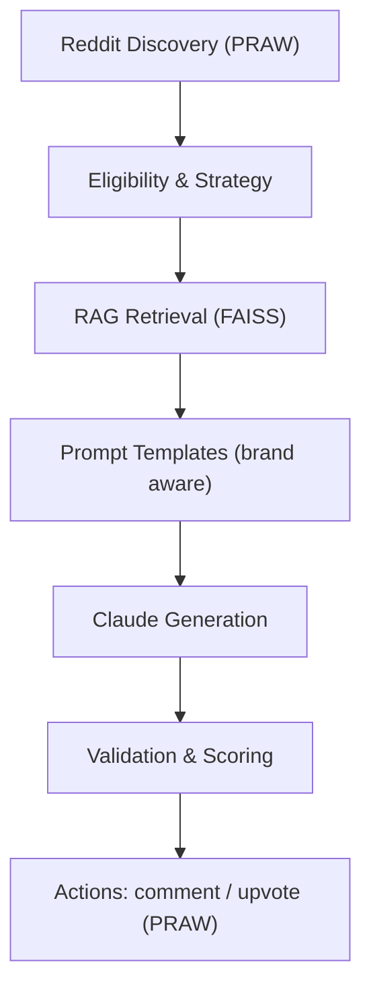

## Marketing Agent (Reddit) – LLM + RAG Orchestrator

### 1) One‑liner
An AI agent that finds high‑value Reddit threads and posts concise, brand‑safe replies using Claude + brand‑specific RAG.

### 2) Why it exists
Brands want authentic engagement without spam. This agent automates discovery and response generation while enforcing voice, safety, and platform rules, keeping promo subtle and helpful first.

### 3) How it works (architecture)
At a glance: Discovery → Eligibility/Strategy → RAG → Prompting → Generation → Validation → Action.



- Discovery: Query subreddits for recommendation requests.
- Strategy: Compute account health; allocate safe activity budget (helpful vs promotional ratio).
- RAG: Retrieve brand knowledge from `brands/<brand>/knowledge` via FAISS.
- Prompting: Central templates enforce brevity, tone, and brand claims.
- Generation: Call Anthropic (Claude) with strict token/temperature settings.
- Validation: Naturalness/length/brand‑safety checks before posting.
- Action: Post comment and track activity with rate‑limit compliance.

Key components:
- `src/reddit/engagement.py`: Unified loop (strategy → retrieval → generation → validation → action).
- `src/llm/prompts.py`: Prompt templates (response, evaluation, claims, intent).
- `src/rag/`: Embedding/indexing (`embedder.py`) and retrieval (`retriever.py`).
- `src/brand/loader.py`: Brand pack loading/validation (YAML + knowledge files).
- `src/utils/config.py`: Typed settings via environment variables.

### 4) Tech stack
- LLM: Anthropic Claude (client with retries)
- Retrieval: Sentence-Transformers + FAISS (local vector search)
- Platform: Reddit via PRAW (rate limiting, safety checks)
- Python: Pydantic/Pydantic Settings, Tenacity, Loguru
- Tooling: uv, Ruff, Pytest, Mypy

### 5) Running locally
Prereqs: Python 3.11+, uv (recommended), Reddit API creds, Anthropic API key.

```bash
# Install
uv sync --dev

# Configure env
cp .env.example .env
# Fill required vars:
#   REDDIT_CLIENT_ID, REDDIT_CLIENT_SECRET, REDDIT_USERNAME, REDDIT_PASSWORD
#   ANTHROPIC_API_KEY

# Build RAG indexes (brand + warming knowledge)
python scripts/index_brand_knowledge.py goodpods
python scripts/index_brand_knowledge.py warming

# Run the agent (scheduled loop)
python main.py

# (Optional) Preview generation without posting
python scripts/test_engagement_preview.py
```

Repo tour:
- Brand packs: `brands/goodpods/*`
- Orchestration: `src/orchestrator.py`
- Agent loop: `src/reddit/engagement.py`
- Prompts: `src/llm/prompts.py`
- RAG: `src/rag/*`, indexer script in `scripts/`


